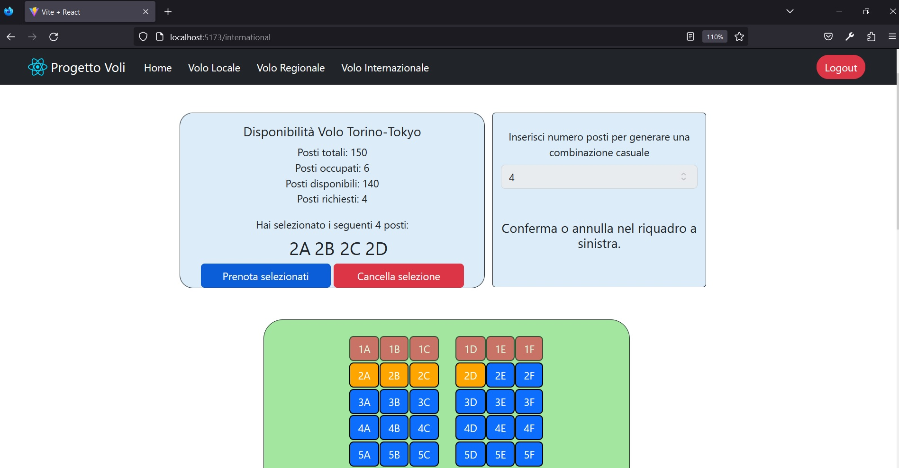

[](https://classroom.github.com/a/_8yXOlwa)
# Exam #2: "Posti Aereo"
## Student: s309864 DALIA VINCENZO 

## React Client Application Routes

- Route `/`: Schermata Home in cui vengono mostrate delle informazioni riassuntive dei tipi di aereo disponibili e attraverso la quale è possibile spostarsi nella pagina specifica di ognuno di questi.

- Route `/login`: Pagina in cui è presente il Form per effettuare il Login (precompilato con le credenziali di un utente per velocizzare la fase di Test), se l'utente è già loggato viene reindirizzato alla route `/`

- Route `/flights/:flight`: Pagina che consente di visualizzare nel dettaglio le informazioni del volo corrispondente al paramtero `(:flight)`, il quale può essere `local`,`regional` o `international`, attraverso la griglia bidimensionale dei posti. 
Da questa schermata è possibile effettuare o eliminare una prenotazione, interagendo con gli elementi mostrati a schermo. 

- Route `*` : Route di default che reindirizza alla pagina di Home

## API Server

####  __Flights__
- GET `api/flights/:flight/free`
  - Descrizione: Recupera il numero di posti disponibili sull'aereo.
  - Request body: _None_
  - Request parameter: Il nome dell'aereo di cui si intende ricavare tale informazione (`local`,`regional` o `international`)
  - Response: `200 OK` o `500 Internal Server Error` 
  - Response body: Un oggetto contenente il numero di posti liberi e il tipo di aereo per cui sono stati richiesti. 
  ```
  {
    plane: "local",
    freeSeats: 55
  }
  ```

- GET `/api/flights/info`
  - Descrizione: Recupera le informazioni riguardanti le righe (file) e le colonne di ogni aereo, utile per calcolare i posti totali di ognuno e per visualizzare correttamente la griglia sullo schermo.
  - Request body: _None_
  - Request parameter: _None_
  - Response: `200 OK` o `500 Internal Server Error` 
  - Response body: Un array di oggetti contenenti informazioni su ogni aereo.

  ```
  [{
		"id": 1,
		"rows": 15,
		"columns": 4,
		"plane": "local",
      "img": "palermo.jpg",
      "description": "Torino-Palermo"
  },
  ...
  ]
  ```

- GET `api/flights/:flight`
  - Descrizione: Recupera tutti i posti per l'aereo preso in considerazione
  - Request body: _None_
  - Request parameter: Il nome dell'aereo di cui si intende ricavare tale informazione (`local`,`regional` o `international`)
  - Response: `200 OK` o `500 Internal Server Error` 
  - Response body: Un array di oggetti in cui sono presenti informazioni su ogni posto, se è libero o occupato.
  ```
  [
   {
		"id": 1,
		"seat": "1A",
		"free": 0,
		"id_user": 3
	},
  {
		"id": 2,
		"seat": "1B",
		"free": 1,
		"id_user": 0
	},
  ...
  ]
  ```

- POST `/flights/:flight/booking` 
  - Descrizione: E' necessario essere autenticati. Una volta selezionati i posti, tramite questa API è possibile prenotare. Verranno effettuati dei controlli prima di procedere, se vengono passati con successo, la prenotazione andrà a buon fine e sarà restituito un numero all'utente, utile per comunicare all'utente che è riuscito a prenotare gli N posti da lui richiesti.
  - Request body: Un oggetto che comprende il numero di posti e l'array di posti che si vuole prenotare.
    ```
    {
	    "seatsNumber": 1,
	    "selected": [ 
        { "id": 167, "seat": "2A"},
        { "id": 168, "seat": "2B"},
        ...
	    ]
    }
    ```
  - Request parameter: Il nome dell'aereo su cui si intende prenotare (`local`,`regional` o `international`), parametro che verrà utilizzato come discriminante nella query al DB.  
  Viene utilizzato req.user.id .
  - Response: `201 Created` o `401 Unauthorized` o `403 Forbidden` o `409 Conflict` o `404 Not Found` o `422 Unprocessable Content` o `500 Internal Server Error` 
  - Response body: Il numero di righe modificate (e dunque posti prenotati) nel DB una volta terminata l'operazione,
    ```
    3
    ```

- POST `/flights/:flight/delete` 
  - Descrizione: E' necessario essere autenticati. Elimina la prenotazione dei posti occupati dall'utente che lancia l'API, relativamente all'aereo utilizzato come parametro della stessa.
  Attraverso la sessione viene recuperato l'id dell'utente, questo verra usato come parametro della query per trovare eventuali prenotazioni.
  - Request body: _None_
  - Request parameter: Il nome dell'aereo da cui si intende cancellare la prenotazione(`local`,`regional` o `international`), parametro che verrà utilizzato come discriminante nella query al DB.  
  Viene utilizzato req.user.id .
  - Response: `201 Created` o `401 Unauthorized` o `404 Not Found` o `500 Internal Server Error` 
  - Response body: Il numero di righe modificate (e dunque posti liberati una volta cancellata la prenotazione) nel DB una volta terminata l'operazione.
    ```
    2
    ```


#### __Login e Logout__
- POST `/api/sessions`:
  - Descrizione: Effettua il login, se va a buon fine verrà generato un cookie.
  - Request body:
  ```
  {
      "username": "utente1@abc.it",
      "password: "abc"
  }
  ```
  - Response: `200 OK` o `401 Unauthorized`

- DELETE `/api/sessions/current`:
  - Descrizione: Effettua il logout, cancellando la sessione.
  - Response: `200 OK`

- GET `/api/sessions/current`:
  - Descrizione: Valuta la sessione per verificare se è valida o meno.
  - Response: `200 OK` o `401 Unauthorized`


## Database Tables

- Table `users` - (id, email, password, salt)  

  Contiene la lista degli utenti e le loro credenziali, la password è memorizzata in formato hash e non in chiaro per ragioni di sicurezza.
  
- Table `seats` - (id, seat, free, id_user, plane)  

  Contiene tutti i posti presenti, l'attributo 'plane' viene usato per indicare se il posto è 'local', 'regional' o 'international' e si riferisce all'attributo 'plane' della tabella flights. 'free' indica se il posto è libero o meno (0 o 1), mentre id_user è a 0 quando il posto è libero, in caso contrario contiene l'id dell'user che l'ha prenotato .

- Table `flights` -  (id, rows, columns, plane, img, description)  

  Contiene i 3 tipi di volo (local,regional e international) con le relative informazioni su righe e colonne, dalle quali è possibile ricavare la capienza massima dell'aereo in termine di posti. L'attributo 'plane' è unique, così come 'img'. 'description' contiene il nome della tratta del volo.


## Main React Components

- `Home` (in `Home.js`): In questo componente, attraverso delle Card, vengono mostrati i 3 tipi di volo presenti nell'applicazione.
Vengono fornite all'utente delle informazioni sommarie sullo stato attuale del volo (Posti totali, Posti disponibili e Posti occupati).

- `MyNavbar` (in `MyNavbar.js`): Navbar tramite la quale è possibile navigare verso gli altri componenti. Se non si è già autenticati, è presente un bottone che rimanda alla pagina di Login, altrimenti sarà presente un bottone che, tramite l'apposita API, fa effettuare il logout all'utente.

- `Login` (in `Login.js`): Form per effettuare il Login, contiene un pulsante per tornare alla schermata principale.

- `Flights` (in `Flights.js`): Componente che, servendosi di GrigliaPosti.jsx, mostra le caratteristiche di uno dei tre aerei, in base al parametro prelevato da useParams(), e permette di compiere operazioni su quel volo (aggiungi o elimina prenotazione).

- `GrigliaPosti` (in `GrigliaPosti.js`): Componente per mostrare a schermo la griglia bidimensionale dei posti, colorati di blu, rosso, giallo o viola in base al loro stato, ossia libero, occupato, selezionato o 'rubato'.
E' possibile interagire direttamente con la griglia di bottoni cliccando sui posti che si intende selezionare.

- `RandForm` (in `RandForm.js`): Componente impiegato per la generazione di un numero N di posti da assegnare all'utente. La logica di assegnazione prevede la selezione dei primi N posti disponibili all'interno dell'aereo.

- `DeleteForm` (in `DeleteForm.js`): Attraverso questo componente  è possibile eliminare la prenotazione e liberare i posti occupati dall'utente.  


## Screenshot



## Users Credentials (email,password)

- (utente1@abc.it, abc) (Utente che ha effettuato una prenotazione su "Locale" e una su "Regionale")
- (utente2@abc.it, abc) (Utente che ha effettuato una prenotazione su "Locale" e una su "Internazionale")
- (utente3@abc.it, abc) (Utente che non ha ancora effettuato una prenotazione)
- (utente4@abc.it, abc) (Utente che non ha ancora effettuato una prenotazione)

